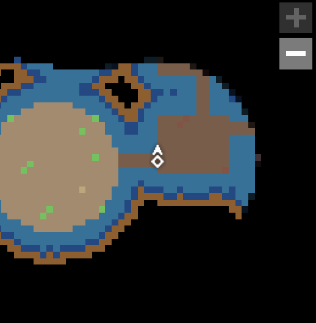
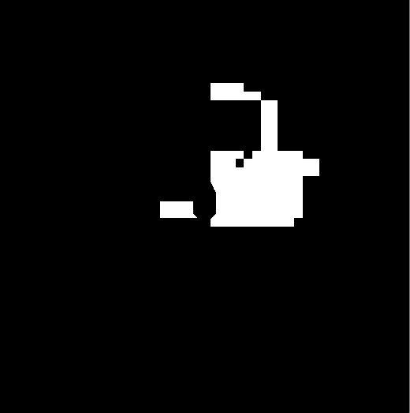
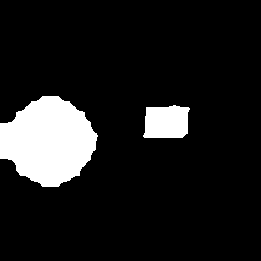
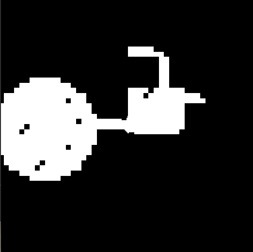
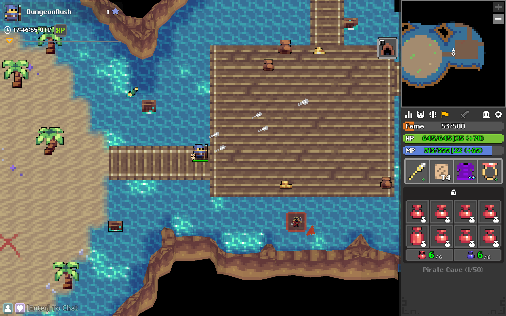
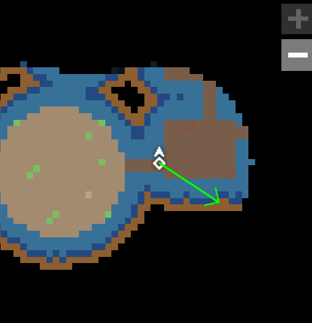

# Dungeon AI

## Description
This project features an autonomous agent that uses computer vision to identify game states and make real time decisions to successfully complete a dungeon.

## Motivation
This project grew out of a curiosity for computer vision and the repetitive nature of grinding dungeons in the game *Realm of the Mad God*. The goal was to build an autonomous agent capable of playing through the entirety of the dungeon using only visual inputs, while also gaining hands on experience applying computer vision techniques to a real time setting.

## Installation

```bash
# Clone the repository
git clone https://github.com/YamatoMatsumura/dungeon-ai.git
cd dungeon-ai

# Install dependencies
pip install -r requirements.txt

# Run the project
python main.py
```

> Note: The player must be in the Pirate Cave dungeon as well as have the screen visible within two seconds after running main for the agent to function correctly.

## How It Works
1. Captures frames from the game window in real time
2. Applies computer vision techniques to understand the current game state
3. Selects and executes actions based on the detected state of the game

## Example Result

## Computer Vision Approach
The agent relies entirely on visual input from the game window. Key regions such as the minimap are extracted and processed into binary masks to represent the game state. Using this information along with the estimated heading of the boss, the agent generates keyboard inputs that navigate the dungeon and pathfind toward the boss.

### Minimap Processing
The agent captures screenshots of the minimap and processes them into multiple binary masks. These masks are combined to identify walkable spaces and define the navigable area for the current game state.

#### Visual Overview

| Original Minimap |
|-----------------|
|  |

| Sand Room Mask | Bridge Room Mask | Room Mask |
|----------------|-----------------|-----------|
|  |  |  |

| Walkable Mask |
|---------------|
|  |

---

### Boss Heading
The agent also captures screenshots of the game window, where template matching is used to determine the direction of the quest icon. This provides an estimate of the general heading of the boss.

| Game Window | Boss Heading Detection |
|------------|----------------------|
|  |  |


### Pathfinding
A set of global points of interest (POIs) is generated by finding the centers of connected components from a subset of binary masks produced during minimap processing. These POIs act as anchor points for navigation. The agent picks the POI that is best aligned with the estimated boss heading, and pathfinds towards it.